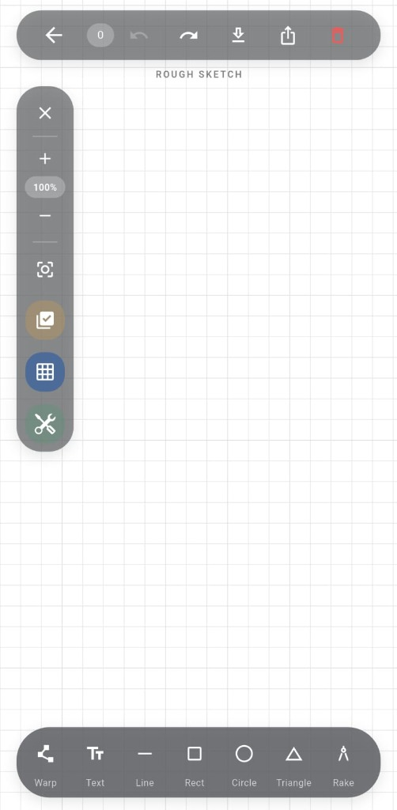
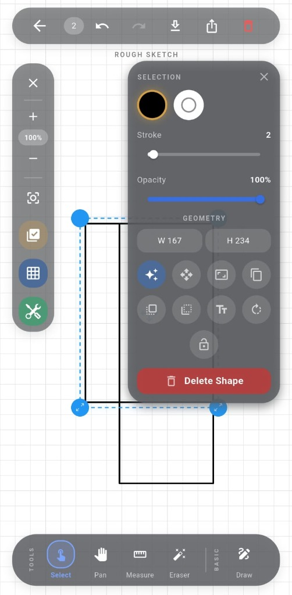

# Industrial Drawing Flutter 🎨

[](https://pub.dev/packages/industrial_drawing_flutter)
[](LICENSE)
[](https://flutter.dev)

A high-performance, production-ready vector drawing engine for Flutter. Designed for industrial applications, engineering tools, and creative whiteboards. Built with a modular architecture that separates the rendering engine from the UI.

---

## 📸 Showcase

<p align="center">
  
  &nbsp;&nbsp;&nbsp;&nbsp;
  
</p>

---

## ✨ Features

- 🛠 **Precision Tools**: Line, Rectangle, Circle, Triangle, and Freehand drawing.
- 📏 **Measurement Mode**: Built-in distance and dimension calculation.
- 🔄 **State Management**: Robust Undo/Redo stack with historical state snapshots.
- 📱 **Hardware Accelerated**: Optimized `CustomPainter` rendering with `RepaintBoundary` support.
- 💾 **Persistence**: Native support for exporting to **PNG** and serializing to **JSON** for cloud storage.
- 🔍 **Infinite Canvas**: Support for smooth Pan and Zoom (Scale) interactions.
- 📐 **Shape Snapping**: Intelligent alignment and snapping for technical accuracy.

---

## 🏗 Architecture

This package follows a **Senior Package Maintainer** architecture to ensure 130+ pub points and maximum reusability:

```text
lib/
├── drawing_engine.dart         # Public API (Barrel file)
└── src/
    ├── controllers/            # DrawingController (Business Logic)
    ├── models/                 # Immutable Data Models (DrawnShape)
    ├── painters/               # Pure CustomPainter Logic
    └── widgets/                # DrawingCanvas (Presentation Layer)
```

---

## 🚀 Getting Started

### 1. Installation

Add this to your `pubspec.yaml`:

```yaml
dependencies:
  industrial_drawing_flutter:
    path: ./ # Or latest version from pub.dev
```

### 2. Basic Usage

```dart
import 'package:industrial_drawing_flutter/drawing_engine.dart';

// 1. Initialize the Controller
final controller = DrawingController();

// 2. Add the Canvas to your UI
DrawingCanvas(
  controller: controller,
  showGrid: true,
)

// 3. Control drawing programmatically
controller.currentTool = DrawingTool.draw;
controller.currentShapeType = ShapeType.rectangle;
controller.undo();
```

---

## 🔧 Controller API

The `DrawingController` is the brain of your application:

| Method / Property | Description |
| :--- | :--- |
| `shapes` | Returns an unmodifiable list of all drawn elements. |
| `addShape(DrawnShape)` | Manually add a shape to the canvas. |
| `undo() / redo()` | Navigate through the action history. |
| `saveToFile(path)` | Serialize the current canvas state into a JSON file. |
| `currentTool` | Toggle between `draw`, `select`, `pan`, and `measure`. |

---

## 🛠 Design Decisions (Senior Reviewer Focus)

- **Headless Logic**: All drawing calculations are performed in the `DrawingController`, allowing you to write unit tests without needing a UI.
- **Lazy Repainting**: The `DrawingPainter` only repaints when necessary to preserve battery and performance on mobile devices.
- **Immutable Models**: `DrawnShape` objects are immutable clones during undo/redo to prevent side effects.

---

## 📄 License

This project is licensed under the MIT License - see the [LICENSE](LICENSE) file for details.

---

## 🤝 Contributing

Contributions are welcome! Please feel free to submit a Pull Request.

1. Fork the Project
2. Create your Feature Branch (`git checkout -b feature/AmazingFeature`)
3. Commit your Changes (`git commit -m 'Add some AmazingFeature'`)
4. Push to the Branch (`git push origin feature/AmazingFeature`)
5. Open a Pull Request
